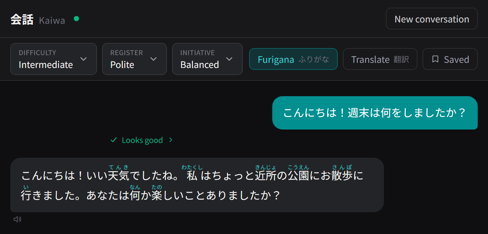

# Kaiwa (会話) — Japanese Conversation Practice

English | [日本語](README.ja.md)

A local-first Japanese conversation-practice app. Hold a natural back-and-forth
in Japanese with an AI partner running entirely on your own machine (via
[Ollama](https://ollama.com)) — no subscription, no required sign-up, no cloud.

> **Status:** v1.0 complete — settings-aware text **and** voice conversation,
> reading aids (furigana, hover dictionary, translation, vocab save), inline
> feedback on your Japanese, and scenario modes. See `PROJECT_BRIEF.md` for the
> full vision and `STATE.md` for the build log.



## Features

- **Streaming Japanese conversation** with a local LLM, with full history kept in
  context each turn.
- **Three behavior controls, adjustable mid-conversation:**
  - **Difficulty** — Beginner · Intermediate · Advanced · Near-Fluent
  - **Register** — Casual · Friendly · Polite · Formal
  - **Initiative** — AI-led · Balanced · User-led
- **Conversation modes:** open-ended **Free Talk**, ten curated **Scenarios**
  (restaurant, hotel check-in, job interview, …), and **Generated** scenarios
  spun up by the model from an optional theme.
- **Reading aids** (opt-in, off by default):
  - **Furigana** over kanji, generated deterministically with SudachiPy.
  - **Hover-lookup** — word definitions (JMdict) and per-kanji readings/meanings
    (KANJIDIC2), served locally, no LLM call.
  - **Translation** of any reply to English (a separate, on-demand LLM call).
  - **Quick vocab save** — one-click save of a word to your browser.
- **Inline feedback** — each message you send gets a collapsible, non-intrusive
  critique (in English, with the corrected Japanese), judged against the register
  you're practicing. Grammar corrections can be saved for review.
- **Voice** — speak your turn (speech-to-text via faster-whisper) and have replies
  read aloud (text-to-speech via VOICEVOX). Both are optional; typing always works.
- Dark, minimal UI tuned for Japanese legibility (Noto Sans JP).
- Clean LLM **provider abstraction** — Ollama (local, default) and Anthropic
  (cloud, opt-in) are both supported; switching is one env-var change.

## Tech stack

- **Frontend:** React + Vite + TypeScript + Tailwind CSS v4 (tested with Vitest)
- **Backend:** Python + FastAPI (managed with [uv](https://docs.astral.sh/uv/),
  tested with pytest)
- **LLM:** Ollama (local, default) — `gemma3:27b`. Anthropic API (cloud, opt-in) — `claude-sonnet-4-6`.
- **Japanese tooling:** [SudachiPy](https://github.com/WorksApplications/SudachiPy)
  (tokenization + furigana), [JMdict](https://github.com/scriptin/jmdict-simplified)
  + KANJIDIC2 (dictionary), compiled into a local SQLite file.
- **Voice:** [faster-whisper](https://github.com/SYSTRAN/faster-whisper) (STT) and
  [VOICEVOX](https://voicevox.hiroshiba.jp/) (TTS).

## Prerequisites

Install and have these available on your PATH:

| Tool | Required for | Notes |
|------|--------------|-------|
| [Node.js](https://nodejs.org) 20+ | everything | frontend |
| [Python](https://www.python.org) 3.12+ | everything | backend |
| [uv](https://docs.astral.sh/uv/) | everything | Python env/deps |
| [Ollama](https://ollama.com) | everything | running locally |
| [VOICEVOX](https://voicevox.hiroshiba.jp/) | voice output (optional) | local TTS engine on `:50021` |
| [ffmpeg](https://ffmpeg.org/) | voice input (optional) | decodes browser audio for STT |

Pull the conversation model (one-time):

```powershell
ollama pull gemma3:27b
```

> **Model choice.** `gemma3:27b` is the default because it stays reliably in
> Japanese. `qwen2.5:32b` has excellent Japanese too but intermittently
> code-switches to Chinese mid-reply, so it's not the default. To try a different
> model, pull it and set `KAIWA_OLLAMA_MODEL` (see Configuration).

## Setup

From the repo root (PowerShell):

```powershell
# Install all dependencies AND build the reading-aids dictionary
npm run setup
```

`npm run setup` also downloads JMdict + KANJIDIC2 and compiles them into
`backend/data/dictionary.sqlite` (a few hundred MB are downloaded once; the file
is git-ignored). To rebuild it later — e.g. for a newer dictionary release — run
`npm run setup:dict`. The app runs without it, but hover-lookup will be empty
until it exists.

Optionally create env files from the examples to override defaults:

```powershell
Copy-Item backend\.env.example backend\.env
Copy-Item frontend\.env.example frontend\.env.local
```

## Running

Start the backend and frontend together:

```powershell
npm run dev
```

- Frontend: http://localhost:5173
- Backend:  http://localhost:8000  (health: `/api/health`)

Make sure Ollama is running and the configured model is pulled first. For voice
output, start VOICEVOX too (the TTS button degrades gracefully if it's absent).

To run them separately: `npm run dev:backend` and `npm run dev:frontend`.

## Testing

Unit tests cover the parts that benefit most from being pinned: system-prompt
composition, the furigana alignment heuristic, the defensive JSON parsing in the
feedback/scenario endpoints, the typed API client, and the conversation hook's
parallel feedback/reply dispatch. None of them require a live model, VOICEVOX, or
the compiled dictionary.

```powershell
npm test            # frontend (Vitest) + backend (pytest)
npm run test:frontend
npm run test:backend
```

## Configuration

Backend settings are read from `backend/.env` (prefix `KAIWA_`). Defaults work
out of the box; see `backend/.env.example` for the full list. Common overrides:

| Variable | Default | Purpose |
|----------|---------|---------|
| `KAIWA_LLM_PROVIDER` | `ollama` | `ollama` or `anthropic` |
| `KAIWA_OLLAMA_MODEL` | `gemma3:27b` | Ollama model used for replies |
| `KAIWA_OLLAMA_BASE_URL` | `http://localhost:11434` | Ollama server URL |
| `KAIWA_ANTHROPIC_API_KEY` | *(unset)* | Anthropic API key (required when provider is `anthropic`) |
| `KAIWA_ANTHROPIC_MODEL` | `claude-sonnet-4-6` | Anthropic model |
| `KAIWA_TEMPERATURE` | `0.7` | Sampling temperature (Ollama only) |
| `KAIWA_TRANSLATION_TEMPERATURE` | `0.3` | Temperature for the translation pass (Ollama only) |
| `KAIWA_FEEDBACK_TEMPERATURE` | `0.3` | Temperature for the feedback pass (Ollama only) |
| `KAIWA_DICTIONARY_PATH` | `data/dictionary.sqlite` | Compiled JMdict + KANJIDIC2 DB |
| `KAIWA_CORS_ORIGINS` | `http://localhost:5173` | Allowed frontend origin(s) |
| `KAIWA_RATE_LIMIT` | *(unset)* | Per-IP limits, e.g. `30/minute,500/hour` (empty = off) |
| `KAIWA_TTS_PROVIDER` | `voicevox` | `voicevox` (local) or `google` (cloud) |
| `KAIWA_STT_PROVIDER` | `whisper` | `whisper` (local) or `google` (cloud) |
| `KAIWA_GOOGLE_CLOUD_API_KEY` | *(unset)* | Google key (required when a voice provider is `google`) |
| `KAIWA_GOOGLE_TTS_VOICE` | `ja-JP-Neural2-B` | Google Cloud TTS voice |
| `KAIWA_VOICEVOX_BASE_URL` | `http://localhost:50021` | VOICEVOX local HTTP API |
| `KAIWA_VOICEVOX_SPEAKER` | `2` | VOICEVOX speaker ID |
| `KAIWA_WHISPER_MODEL` | `base` | faster-whisper model size |
| `KAIWA_WHISPER_DEVICE` | `cuda` | faster-whisper device (`cuda` or `cpu`) |

Frontend (`frontend/.env.local`): `VITE_API_BASE_URL` (default
`http://localhost:8000`) and `VITE_STORAGE` (`backend` default, or `local` for
browser localStorage).

### Switching to Anthropic

1. Install the optional dependency: `uv sync --extra anthropic` (from `backend/`)
2. Add to `backend/.env`:
   ```
   KAIWA_LLM_PROVIDER=anthropic
   KAIWA_ANTHROPIC_API_KEY=sk-ant-...
   ```
3. Run `npm run dev` as normal — no other changes needed.

The active provider and model are shown in the header and in the Settings panel.
To switch back to Ollama, remove (or comment out) those two lines.

## Deploying a live demo (cloud)

Kaiwa is local-first; the cloud build is the same app with each capability
switched to a hosted provider by config — no separate codebase. The local
defaults are untouched.

| Capability | Local (default) | Cloud |
|-----------|-----------------|-------|
| LLM | Ollama | Anthropic (`KAIWA_LLM_PROVIDER=anthropic`) |
| TTS | VOICEVOX | Google Cloud (`KAIWA_TTS_PROVIDER=google`) |
| STT | faster-whisper | Google Cloud (`KAIWA_STT_PROVIDER=google`) |
| Saved data | `/api/store` document store | browser localStorage (`VITE_STORAGE=local`) |

> Cloud TTS plays audio but has no per-word highlight — Google returns no mora
> timing. The karaoke-style highlight is a local-VOICEVOX feature.

**Backend → Google Cloud Run.** The container ([`backend/Dockerfile`](backend/Dockerfile),
reading-aids dictionary baked in at build time) deploys to Cloud Run — serverless,
scales to zero when idle, and free at demo-level traffic. One-time setup in a GCP
project (the same project as the TTS/STT key works well):

1. Enable the APIs: Cloud Run, Cloud Build, Secret Manager, Text-to-Speech,
   Speech-to-Text.
2. Store the secrets in Secret Manager as `kaiwa-anthropic-api-key` and
   `kaiwa-google-cloud-api-key`, and grant the Cloud Run runtime service account
   the *Secret Manager Secret Accessor* role.
3. Restrict the Google API key to the Text-to-Speech and Speech-to-Text APIs
   (Credentials → key → API restrictions), and set a billing budget alert.
   Also cap spend in the Anthropic console.

Then deploy (and redeploy updates) with
[`backend/scripts/deploy_cloudrun.ps1`](backend/scripts/deploy_cloudrun.ps1):

```powershell
.\backend\scripts\deploy_cloudrun.ps1 -ProjectId <gcp-project> -CorsOrigin https://<your-app>.vercel.app
```

The script wraps `gcloud run deploy --source backend` with the cloud provider
env vars, the secret mounts, a `KAIWA_RATE_LIMIT`, and a 2-instance cap.

**Frontend → Vercel.** Set the project root to `frontend/`
([`frontend/vercel.json`](frontend/vercel.json) handles the build + SPA
rewrite), and set the following in the Vercel dashboard
(Settings → Environment Variables → Production):

| Variable | Value |
|---|---|
| `VITE_API_BASE_URL` | The Cloud Run service URL (e.g. `https://kaiwa-api-xxxx.a.run.app`) |
| `VITE_STORAGE` | `local` |
| `VITE_ALLOW_CUSTOM_SCENARIOS` | `false` |

`VITE_ALLOW_CUSTOM_SCENARIOS=false` removes the "Design Your Own" scenario
form. That form lets users inject arbitrary instructions into the system prompt
(via the freeform notes field), which is fine locally but undesirable on a
shared deployment. Free Talk, Scenarios, and Generated modes are unaffected.

## Scripts

| Command (repo root) | Does |
|---------------------|------|
| `npm run setup` | Install all dependencies + build the dictionary |
| `npm run setup:dict` | (Re)build the reading-aids dictionary only |
| `npm run dev` | Run backend + frontend |
| `npm run build` | Build the frontend |
| `npm test` | Run frontend + backend tests |
| `npm run lint` | Lint frontend (ESLint) + backend (ruff) |
| `npm run format` | Format frontend (Prettier) + backend (ruff) |

Backend model A/B harness (compares models for Japanese fidelity):

```powershell
uv run --directory backend python scripts/eval_models.py
```

## Known limitations (v1.0)

- Very long sessions will eventually approach the model's context window; the
  full history is sent each turn (no summarization yet). Acceptable for v1.0.
- Switching register *mid-conversation* shifts the next reply's tone but may be
  gradual, since the model also honors the existing conversation's register.
- Feedback and generated-scenario quality depend on the local model's judgement;
  the response *shape* is enforced, the linguistic judgement is not.

## Project structure

See [`CLAUDE.md`](CLAUDE.md) for the directory layout and engineering
conventions, and `PROJECT_BRIEF.md` for the full product vision and phase plan.

## License

[MIT](LICENSE) © 2026 Luke Lakea.
